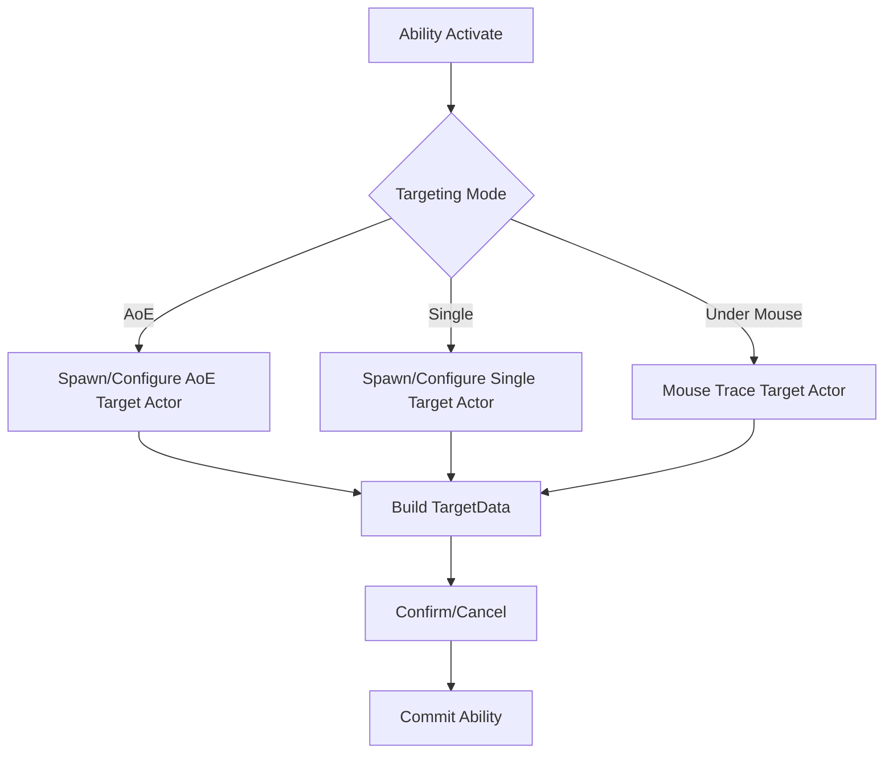
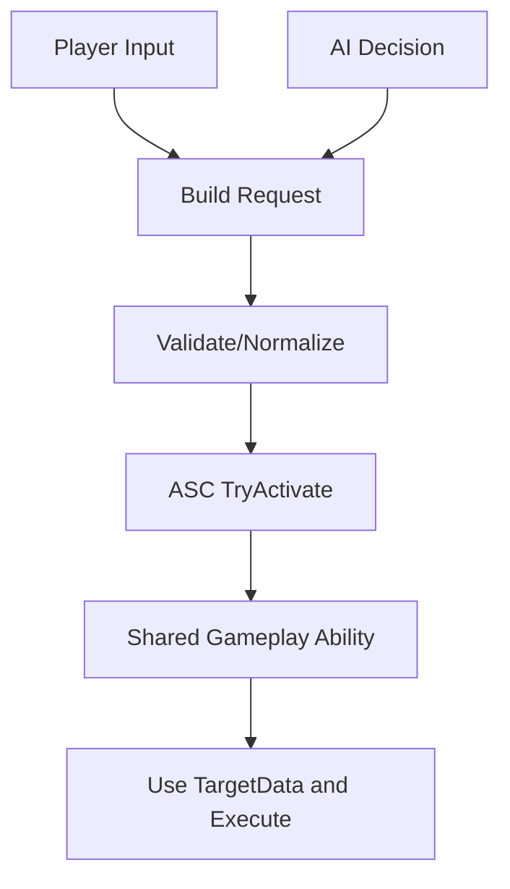

現在取り組んでいる内容の概要です。実装の詳細はIP保護のため伏せ、概念レベルの擬似コードのみ記載します。

## 1) カスタムターゲティングシステム（アビリティ基盤）

複数のターゲット方式に対応するカスタムターゲティングを実装しました。AoE対象、単体対象、マウス下単体対象を統一的に扱えるようにして、アビリティの基盤にしています。

<----画像 / スクリーンショットをここに挿入 ----->

### 実装イメージ（擬似コード / C++・Unreal）

```cpp
// pseudocode
UENUM()
enum class ETargetingMode : uint8
{
  AoE,
  SingleActor,
  UnderMouse
};

struct FTargetingRequest
{
  ETargetingMode Mode;
  float Range;
  float AoERadius;
  AActor* Source;
};

class UTargetingResolver : public UObject
{
public:
  FGameplayAbilityTargetDataHandle ResolveTargets(const FTargetingRequest& Request)
  {
    switch (Request.Mode)
    {
      case ETargetingMode::AoE:
        return BuildTargetDataFromAoE(Request);
      case ETargetingMode::SingleActor:
        return BuildTargetDataFromSingle(Request);
      case ETargetingMode::UnderMouse:
        return BuildTargetDataFromMouseTrace(Request);
      default:
        return FGameplayAbilityTargetDataHandle();
    }
  }
};
```

### フロー



## 2) 共通ベースアビリティシェル

3種類のターゲットアクターを共通で扱える「ベースアビリティシェル」を用意し、後からAoEブリザード、単体回復、瞬移、ギャップクローズなどへ拡張します。

### 実装イメージ（擬似コード / C++・Unreal）

```cpp
// pseudocode
class UGA_BaseAbility : public UGameplayAbility
{
  GENERATED_BODY()

protected:
  UPROPERTY(EditDefaultsOnly)
  ETargetingMode TargetingMode;

  UPROPERTY(EditDefaultsOnly)
  TSubclassOf<AGameplayAbilityTargetActor> TargetActorClass;

  virtual void ActivateAbility(
    const FGameplayAbilitySpecHandle Handle,
    const FGameplayAbilityActorInfo* ActorInfo,
    const FGameplayAbilityActivationInfo ActivationInfo,
    const FGameplayAbilityEventData* TriggerEventData) override
  {
    StartTargeting(ActorInfo);
  }

  void StartTargeting(const FGameplayAbilityActorInfo* ActorInfo)
  {
    // Spawn target actor and wait for confirmation
    // When confirmed, call OnTargetsReady
  }

  void OnTargetsReady(const FGameplayAbilityTargetDataHandle& TargetData)
  {
    ExecuteAbility(TargetData);
  }

  virtual void ExecuteAbility(const FGameplayAbilityTargetDataHandle& TargetData)
  {
    // To be implemented by child abilities
  }
};
```

### フロー

```mermaid
flowchart TD
  A[GA_Base Activate] --> B[Start Targeting]
  B --> C[Target Confirmed]
  C --> D[ExecuteAbility (child override)]
  D --> E[Apply Effects / Spawn VFX]
```

## 3) プレイヤーとAIで共通化したアビリティ運用

多くのUEプロジェクトはプレイヤー用とAI用でアビリティを分けがちですが、私は同一アビリティを全GASエンティティで使える設計にしたいです。クラス肥大化を避けるため、入力やAI判断の差分は「リクエスト構築側」に寄せる方向で設計中です。

<---プレイヤー操作／AI操作のガスエンティティが同一ゲームプレイ能力を使用するスクリーンショット--->

### 実装イメージ（擬似コード / C++・Unreal）

```cpp
// pseudocode
UENUM()
enum class EAbilityActivationSource : uint8
{
  PlayerInput,
  AI
};

struct FAbilityActivationRequest
{
  TSubclassOf<UGameplayAbility> AbilityClass;
  FGameplayAbilityTargetDataHandle TargetData;
  EAbilityActivationSource Source;
};

class UAbilityRequestBuilder : public UObject
{
public:
  FAbilityActivationRequest BuildFromPlayer(...);
  FAbilityActivationRequest BuildFromAI(...);
};

class UAbilityActivationRouter : public UObject
{
public:
  void RouteRequest(UAbilitySystemComponent* ASC, const FAbilityActivationRequest& Request)
  {
    // Validate and normalize request
    ASC->TryActivateAbilityByClass(Request.AbilityClass); // pseudocode
  }
};

class UGA_SharedAbility : public UGA_BaseAbility
{
  // No player/AI branching here. It only consumes TargetData.
};
```

### フロー



## 4) アートディレクション（楽しい部分）

ビジュアル面ではVRoid系のキャラクターとトゥーンシェーダーを使う方針です。3Dはまだ初心者なので、この方向性で開発スピードと一貫性を両立させたいと考えています。
