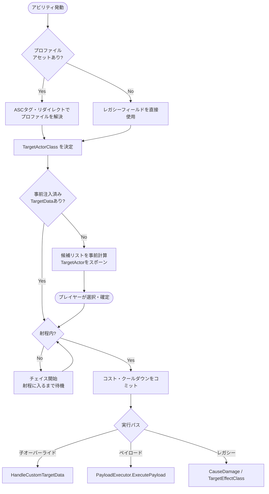

今回はアビリティのターゲティング基底クラスの話です。**スペルの「当て方」を実行時に差し替えられる仕組み**を作ったので、その設計をまとめます。

これが実現すると何が嬉しいかというと、同じファイアボールでも、ステータス次第で単体に集中させたりAoEにしたりができます。スペルの動作をバフ・デバフで動的に変える、つまりゲームプレイのセオリークラフト要素を増やせます。

---

## 構造の核：ターゲティングプロファイル

アビリティの中に「このターゲットアクターを使え」とハードコードするのではなく、**ターゲティングプロファイルというデータアセットで外から差し込む**設計にしました。

プロファイルには以下のような情報が入っています。

| 項目 | 内容 |
|---|---|
| `TargetActorClass` | どの方式でターゲットを取るか |
| `MaxTargets` | 最大ヒット数 |
| `AoeRadius` | AoEの範囲 |
| `MaxCastRange` | 射程 |
| `TeamPolicy` | 敵のみ・味方のみ・全対象 |

このプロファイルをアビリティに差し込むと、ターゲティングの挙動が丸ごと変わります。同じアビリティクラスが単体にも全体にも動きます。

---

## ターゲットアクターの種類

プロファイルが選んだ `TargetActorClass` によって、実際の選択UIと返されるデータが変わります。

| クラス | 挙動 |
|---|---|
| `Single` | 候補リストを前後に切り替えて1体選択 |
| `Multi` | ピボットを中心にグループをまとめて選択 |
| `AoE` | 地面にデカールを置いてエリアを指定 |
| `UnderMouse` | カーソル直下のターゲットを自動取得 |
| `AutoSelf` | 次のTickに即確定、自分を対象にする |

AoEだけ特殊で、ターゲットアクターは「地点」だけを返します。実際に範囲内の誰を巻き込むかはアビリティ側がサーバーで確定させます。これで予測と権限の分離が綺麗に保てます。

---

## プロファイルが切り替わる仕組み

最も面白い部分がここです。プロファイルの解決は固定ではなく、**ASCに付いているタグで動的に変わります**。

解決の優先順位はこうなっています。

1. デフォルトのプロファイルタグから開始
2. ゲームモード側のリダイレクトルールを適用
3. ASCが持つ優先タグを確認 (`Status.TargetProfile.AoE` など)
4. ASCが持つタグとアセット内のキーが一致するか確認
5. デフォルトにフォールバック

リダイレクトの例：

- `Status.Buff.Tactician` を持っていると → 単体回復が全体回復に変わる
- `Status.Debuff.Confuse` を持っていると → 対敵AoEが対味方AoEになる
- `Status.Debuff.Narrowminded` を持っていると → AoEスペルが単体に絞られる

バフやデバフがスペルの「形」そのものを変える、というデザインが自然に成立します。

---

## ターゲット確定後の実行パス

ターゲットが確定した後、実際に何をするかは3段階で決まります。

1. **子クラスオーバーライド** — 子が自分で処理する場合
2. **ペイロードエグゼキュータ** — 専用の実行オブジェクトに委譲する場合（例：プロジェクタイル発射、ディレイ付き連射など）
3. **レガシーパス** — ターゲットにダメージGEを直接適用する最もシンプルな経路

ダメージの数値計算（属性、スケーリング、デバフ値など）はすべて共通の親クラスが担うので、どの実行パスを通っても同じダメージ定義を再利用できます。

---

## 全体フロー

---

## 実際の設計判断

いくつか迷ったところを記録しておきます。

**AoEのアクター収集をサーバー側に置いた理由** — ターゲットアクターに収集させると、クライアント側の見た目と権限側の結果がズレるリスクがある。地点だけ受け取って、実際の巻き込み判定はサーバーでやるのが安全。

**プロファイルとリダイレクトを別アセットにした理由** — アビリティ側は「自分のプロファイル一覧」だけを知っていれば十分。「どのタグが来たときにどう変換するか」はゲームモード側が持つグローバルな知識なので、アビリティが直接持つべきではない。

**ペイロードが `bSuppressShellEndAbility` を持てる理由** — ターゲット確定→コミットまでは共通、そこから先は「すぐ終わるか」「プロジェクタイルが全弾着弾するまで生き続けるか」でライフサイクルが変わる。ペイロードがそれを制御できることで、同じシェルでインスタントとディレイ付きの両方を扱える。

ターゲティングを切り替えられるようにしたことで、スペルのデザインスペースがかなり広がりました。今後バフ・デバフのバリエーションを増やすのが楽しみな部分です。
